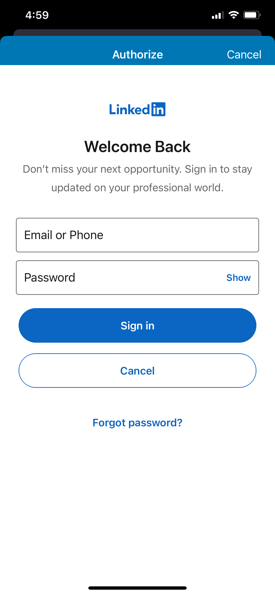

# Swift Package Manager for LinkedIn Sign In

This SwiftUI package provides a streamlined way to integrate LinkedIn Sign-In functionality into your iOS applications. It handles the OAuth2 authentication flow, allowing users to log in with their LinkedIn credentials and retrieve an access token for further API interactions.

## Features

- Easy integration with LinkedIn OAuth2 authentication.
- Customizable login view with support for loading indicators.
- Handles authorization, token exchange, and error handling.
- Provides a simple API for initiating the login process and retrieving the access token.

## Installation

1. Install the package via Swift Package Manager:

```swift
.package(url: "https://github.com/DevboiDesigns/LinkedInSignIn-SwiftUI.git", .upToNextMajor(from: "1.2.0"))
```

2. Import the package in your project:

```swift
import LinkedIn_SignIn
```

### Usage

- [LinkedIn Developer Portal](https://developer.linkedin.com)

  1. Set up your LinkedIn app on the Developer Portal.

  2. Create a LinkedInConfig object with your LinkedIn credentials:

```swift
let linkedinCredentilas = [
    linkedInKey: "YOUR_LINKEDIN_KEY",
    linkedInSecret: "YOUR_LINKEDIN_SECRET",
    redirectURL: "YOUR_REDIRECT_URL"
]
```

3. Implement the getRootViewController function to get the root view controller:

```swift
 static public func getRootViewController() -> UIViewController {
        guard let screen = UIApplication.shared.connectedScenes.first as? UIWindowScene else { return .init() }
        guard let root = screen.windows.first?.rootViewController else { return .init() }
        return root
    }
```

4. Initialize the LinkedinHelper and start the login process:
   Login proces - Opens a web view to sign and get access token, token can be used via the LinkedIn SignIn [API](https://developer.linkedin.com)

```swift
let linkedInConfig = LinkedInConfig(linkedInKey: linkedinCredentilas["linkedInKey"]!, linkedInSecret: linkedinCredentilas["linkedInSecret"]!, redirectURL: linkedinCredentilas["redirectURL"]!)
let linkedInHelper = LinkedinHelper(linkedInConfig: linkedInConfig)
linkedInHelper.login(from: getRootViewController(), completion: { (accessToken) in
 // DO STUFF
}
```

---



---

# License

LinkedInSignIn is available under the MIT license. See the [LICENSE](LICENSE) file for more info.

## Star on GitHub 🤩

If you like this tool please take a moment to
[star it on GitHub](https://github.com/devboidesigns/LinkedInSignIn-SwiftUI).

[](https://github.com/devboidesigns/LinkedInSignIn-SwiftUI#start-of-content)

<sup>Originally created by [Serhii Londar](https://github.com/serhii-londar/LinkedInSignIn), I just put it into a swift package</sup>
